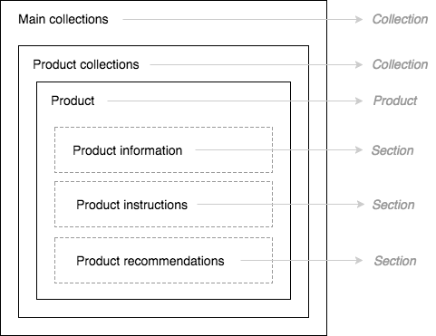
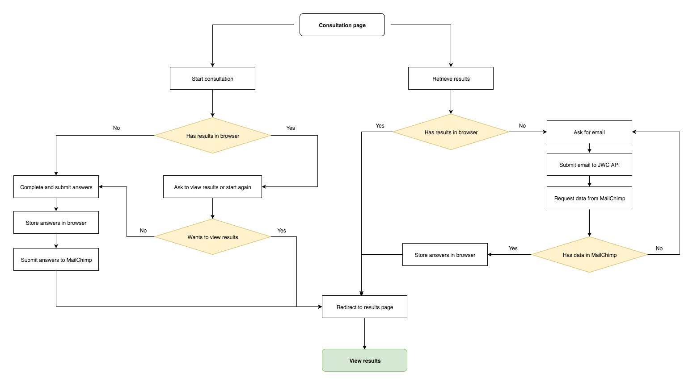

# Josh Wood Colour - Shopify

JoshWoodColour - Shopify is a Shopify theme that supports pages, blogs, products and collections in a Shopify environment. 

[View production site](https://joshwoodcolour.com/).
[View staging site](https://josh-wood-colour-staging.myshopify.com/).

## ⬇️ Installing / Getting started

To get started, cd into your working/dev folder.

```shell
git clone git@bitbucket.org:maido/josh-wood.git
cd josh-wood
```

### Shopify Theme

The Shopify theme can be found in the `josh-wood-colour-shopify` folder.

In order to start developing the theme, you must add the necessary passwords in `./josh-wood-colour-shopify/config.yml` for both staging and production stores. This allows you to authorise and sync content and source files between your local and live (staging or production) environments.

To find the passwords, follow these steps:

- Navigate the store's admin
- Click 'Apps' from the main navigation on the left
- Click the 'Manage private apps' link at the bottom of the right column, displayed under the app listing
- Click the name of the private app 
- Copy and paste the password from the 'Admin API' section into the relevant part of the config.yml


### API

The API server/files can be found in the `josh-wood-api` folder.

### Data summaries

The data summary scripts can be found in the `josh-wood-colour-data-summaries` folder.


## 🛠 Front-End Stack

### JavaScript

- Compiled with Webpack (3.x) and Babel (6.x)
- ES6 Modules
- ES6 features (const, let, spread, rest, arrow functions, template literals)
- [Flow static typing](https://flow.org/)
- [Preact](https://github.com/developit/preact)/[React](https://github.com/developit/preact-compat) (see [notable features](#notable_features))


### Sass
- Compiled with Webpack and NodeSass
- [Inuit CSS](https://github.com/inuitcss/inuitcss)
- [Namespacing](https://csswizardry.com/2015/03/more-transparent-ui-code-with-namespaces/)
- PostCSS
   - [Autoprefixer](https://www.npmjs.com/package/autoprefixer)
   - [MQPacker](https://www.npmjs.com/package/css-mqpacker)

We use a combination of BEM and functional CSS (a la [Tachyons](https://github.com/tachyons-css/tachyons)) for building reusable, composable CSS. Where there is feature-specific styling we will create modules that follow BEM principles, but otherwise we use the functional CSS part. E.g. specific classes for flex, padding, margin, background colours etc. The prefixing/namespacing (`c-` for components, `u-` for utility classes, etc.) feature heavily throughout the code.


## 🖥 Developing

To work on Shopify themes locally you must have Shopify's [Slate](https://github.com/Shopify/slate) tools installed. This is a powerful CLI that includes testing and deployment to your Shopify store and it is *very* helpful.

For all the required information on Slate, please [refer to the official documentation](https://shopify.github.io/slate/).

### Linting

The project uses [Flow](https://flow.org/) and [Prettier](https://github.com/prettier/prettier). These are tools that can be used from the command line and/or as part of a build system, but work even better when use with your favourite editor (i.e. Sublime) as they format and validate your code as you type/save.

These instructions are for Sublime, but there are alternatives available for other editors or IDEs too.

- [http://www.sublimelinter.com/en/stable/](http://www.sublimelinter.com/en/stable/)
- [https://github.com/SublimeLinter/SublimeLinter-flow](https://github.com/SublimeLinter/SublimeLinter-flow)
- [https://github.com/jonlabelle/SublimeJsPrettier](https://github.com/jonlabelle/SublimeJsPrettier)	


### Building

We don't use Slate's JS or Sass tools so we need to run both our Webpack tools and Slate's tools together. Instead of the standard `slate start` command, we need to instead run:

```shell
npm start
```

This setup is still a WIP but gets the job done for now.

**NB**: When developing locally, any changes are automatically synced with the Shopify store, so it's important to only work on the staging store in case any breaking changes are introduced to the production store.

### Testing

Test the Shopify configuration using Slate's functionality.

```shell
slate test
```

Test the Front-End code with Mocha, Sinon, Chai and Enzyme.

```shell
npm run test
```


### Commiting

We use [Husky](https://github.com/typicode/husky) to manage our commits. It allows to make sure before we commit any changes we format, test and compile our code.


### Deploying / Publishing

To deploy all changes to the Shopify Staging environment you simply run this single command:

```shell
slate deploy --env development
```

And for Production:


```shell
slate deploy --env production
```


## 🏗 Shopify architecture

### Navigation

We use 4 sets of navigation. 

- Main: Contains the site's top level navigation items such as About and Salon
- Secondary: Contains the site's secondary navigation items such as Terms & Conditions and Privacy Policy
- Feature: Contains the site's highighted non-primary navigation such as a Competition
- Social: Contains Josh Wood's social channels

### Settings

Here is where a lot of site features and one-offs can be edited.

- **Third party configuration**: add any keys required for APIs and libraries
- **Contact information**: edit adddress, phone number and contact email
- **Contact form**: edit messages and labels for the form, including Zendesk 'subjects'
- **Form consent**: edit messages used for global form consent
- **Shop settings**: select the default 'Permanent Colour' product, and labels for fulfilment statuses
- **MailChimp newsletter**: edit URLs and fields name for the site's MailChimp newsletter 
- **Promo banner**: add an optional promo message and optional link
- **Promo popup**: add content for promotional modals used globally
- **User accounts**: set the 'help' text show in user account pages 
- **Checkout**: customise some checkout visual styles


### Pages

Every URL from the brochureware (i.e. non-commerce) has a page created. Nearly all of these pages have most of their content managed and created via Theme Sections. Every page should have a title and some content added for SEO reasons. Most pages also have a custom template where we define layout and editable content.

### Theme Sections

Each template has its own Sections that are only available in that template, as well as sharing generic Sections throughout the site. 99% of the content on the site is controlled via Sections. For the shared sections, there can be no difference in content; [each Section is a singleton](https://help.shopify.com/themes/development/theme-editor/sections) and knows nothing of its external template, nor does the external templatek know anything about the Section.

### ⚠️ Considerations

Shopify is very possessive does not like to have its content taken away from it. Simple actions such as deleting a navigation item or renaming a template name can wipe out swathes of content on the site. When this happens, the content is removed from the `config/settings_data.json` file without any confirmation first. If this happens, follow these steps to debug:

- If you have deleted an item (navigation or page), add it back with its previous values intact
- Open the `settings_data.json` file [within Shopify](https://josh-wood-colour.myshopify.com/admin/themes/2196668439?key=config/settings_data.json) (NOTE! This file is not tracked)
- On the right side of the page there should a box with code in it (JSON), at the top will be the filename, beside that will be a 'Older versions' link
- From the older versions dropdown, select a previous version that is most relevant and restore it
- Check that the content has been restored on the site
- If it's not been restored, keep trying older versions until it works
- If it is restored, you will need to replan how to perform the action in a non-destructive way.


## 🛍 Ecommerce

### Collections

##### Types and naming

There are two types of collections. 'Main' collections are the three main product groups: Permanent colour, Concealer range and Care products. 'Product collections' are collections used to group  variants of each product type together: Permanent Colour, Root Marker, Shade Shot, etc. We do this so we can easily create the product lists on the [shop page](https://joshwoodcolour.com/collections/all). The products shown here are actually 'Product' collections and the link to the first product in that collection (whether it is sorted by title, popularity, etc.).

When using the Shopify CMS, it is easy to see the difference between the two. 'Main' collections have no image, but 'Product' collections do.

#### ⚠️ Do not rename

There is many custom templates that allow us to group products into the 3 main collection types, including the cart and the Consultation results. 

Due to this, it's **extremely** important not to rename the collections without updating the templates at this will cause errors and some important parts of the site will not work.

#### Permanent Colour collections

Both the 'main' and 'product' collection for Permanent Colour is the same. It is not possible to have collections with the same slug, but it is possible to have the same name. To support this, the 'Main' collection's slug is 'permanent-colour' and the 'Product' collections' slug is 'permanent-colour-products'. This should also not be changed.


### Products

#### Variants

In a regular shop setup we would create product options as 'variants'. This results in 1 product, with multiple options, such as 'Short sleeved t-shirt' with the options *black*, *brown*, or *red*. 

The downside to this approach is there is only one URL available (due there being only 1 product). However, even though it could e assumed that the product would be 'Shade Shot' and options of 'Warm me up' and 'Cool me down', we have created these as 2 separate products. This gives us the advantage of 2 URLs meaning improved SEO. 

This setup is why we have 2 collection types. The 'Product' collection type acts as our way of creating product variants. When looking at, say, the Shade Shot product, we get its variants by selecting all products that are in the 'Shad Shot' product type.

#### Templates

To create the product templates we make use of the built-in product content and custom sections. Product information, instructions and recommendations are all managed by sections which link to a product page.



### Permanent product distinctions

Permanent products include an extra variant selector. There is the standard 'dropdown' selector as well as the 'swatch' selector; a list of the buttons that have each permanent colour's hair swatch image.

Permanent products also include a 'Shade comparison' section that allows a user to compare dark, medium and light versions of each permanent product.

All products use the 'featured' image, except for Permanent Colour products which first look for a 'box' image before defaulting to the featured image. Permanent Colour products also show an extra 'hair' image.


### Care product distinctions

Care products have both blonde and brown versions so each product's selector is different for than the other collections. First, a user selects their hair colour and *then* the product type they want. This can be seen on the [Shampoo product page](https://joshwoodcolour.com/products/frizzy-brunette-shampoo).
 
Shade shot products also include a 'colour comparison' section that allows a user to compare the effects of the warm or cool Shade Shot on blonde or brown hair.

### Cart

As well as the cart page, we have a cart 'summary' modal that a user can view from anywhere on the site. When clicking on the main 'Cart' link in the navigation, the user will always see this modal first.


### JavaScript enhancements

Many parts of the shopping experience is extended or created by custom JavaScript. Those sections are:

- **Products**
	- When changing a product 'variant', all main product content will update too:
		- Photos
		- Content (price, etc.)
		- Options
		- Information (description, ingredients, warnings)
		- Instructions
		- Recommended products
		- Add to cart button status (available/sold out)
		- Shade/colour comparison sections
	- Adding a product to the cart
	- Updating the cart summary in the main navigation
	- Updating the cart summary modal
	- Preloading assets
- **Cart**
	- Updating a product's quantity
	- Removing a product
	- Updating the cart summary in the main navigation
	- Updating the cart summary modal


## 💬 Consultation tool

The Consultation Tool is a bespoke React app utilising a 'chat' interface. There is a full test suite for the tool that shows how it all fits together.

### Questions

The questions can be found in `src/js/consultation-questions.js`. Questions can be skipped, disabled depending on certain answers.

When adding new questions it's important to give it a unique ID. When progressing, disabling, or skipping questions it is based on its ID.

When removing questions, it's important to update the questions or answers that link to the deleted question.


### Storage

When a consultation is completed the answers are submitted to MailChimp – but only if a user opts-in to saving their answers with their email. However, regardless of opting-in, the results are stored in the browser with localstorage.

This allows us to immediately show a user their results again if they use the same browser and device. However, if a user wants to get their results on a different device or browser and they saved by email, they can retrieve their results by email. See below for the flow.




### Logic

The logic matrix supplied by the client is available at `./consultation-tool-logic-final-edit.xlsx`. While there have been minor changes – which are available in the code, and all logic is tested, these are the expected outcomes – the reasons for the logic are supplied in the Excel sheet.

The products are tightly coupled to the various questions and answers in the Consultation, so if there are to be any copy changes or additions to the Consultation questions, these changes must be reflected in the `src/js/components/consultation-results.js` file. After any copy changes, you can check the results are the same by running `npm run unit-tests`. 

If there are to be more products added, these must be defined in each function that matches products to a user's answers. E.g. `getBlendingBrushMatches()`. These relationships aren't defined in the Shopify admin so we must make them in the source code (reminder: all recommendations are done on the client side in JS).

### Results

Due to Shopify only supporting static assets, we create the consultation recommendations on the fly every time with JavaScript. The source can be found in `src/js/consultation-results.js`. There is a full test suite for the results. 

Since the results are created on the fly, we have to create the template in JavaScript. This is done with React.

Note that if questions change, there will be a lot of tests that will need updating too! 


<a name="notable_features"></a>

## 🌟 Notable Features

### Cookie policy

The site's GDPR cookie management is provided by [Cookiebot](https://www.cookiebot.com/en/). We provide additional styling on top of the default styling provided by Cookiebot to make it 'prettier' and more inline with the site's style. All content is defined in Cookiebot and the banner and policy page is added dynamically by including the required scripts. The Cookiebot key is defined in the Theme Settings' Third Party Configuration section.

### Salon Price List

The price list content is all hard coded. Any copy changes must be done directly in the template.

### Cards

Throughout the site we use a 'Card' component that is made up of optional parts and configurations:

- Image
- Frame
    - Colour 
        - Gold
        - Silver
    - Position
       - Left
       - Right
   - Size
       - Tall
       - Short
       - Square
- Title
   - Position
       - Left
       - Right
- Orientation
   - Vertical
   - Horizontal (row)

Variations of these cards can be seen on the [Home](https://joshwoodcolour.com/) and [The Experts](https://joshwoodcolour.com/pages/the-experts) pages.

### Parallax

Various components of the site use [vertical Parallax](https://github.com/dixonandmoe/rellax), notably images and Card frames.

### Scrolling reveal

Throughout the site there are components that 'fade in' when they [enter the viewport](https://www.npmjs.com/package/scrollmonitor) for the first time. These include quotes or the cards on The Experts listing page.


### Experts Listing/Detail pages

Shopify has no 'list/detail' type pages. To get around this for The Experts pages we have done the following:

- Create an 'The Expert' section that has all the content required for an expert (e.g. name, image, bio, etc.)
- Create a Shopify page for each expert, which has a title that exactly matches the name defined in the section. On the page, we loop through all expert sections and get the one that matches the page title, thus allowing us to the show the details.
- Create a Shopify listing page for the experts, and generate the layout and content on the fly with the content from all sections. This is done with React.

### Preact

We use [Preact](https://preactjs.com/) instead of React. Preact is a smaller version of React, with the same API, but with some omitted features. We swap Preact for React in our Webpack (defined in `resolve`) configuration. The version of Preact is compatible with React versions <= 15. 


## 📊 Data summarising

There are a number of scripts to summarise and group external data. This allows us to gain some insight as well as have the option to export to other tools for visualisation.

#### MailChimp – Consultation entries

This only includes users who have opted to save their Consultation by email. It includes individual journies and question sets.

1. Export the list data as a CSV from MailChimp
	2. Go to: Lists
	3. Toggle the dropdown on the 'Consultation Form' list
	4. Selecte 'Exports'
2. Copy the download file to the same folder as the script
3. Run the following command `FILE=[name of file].csv yarn consultation-mailchimp`
4. It will ouput an anonymised summary of all the Consultation data as a JSON file
	5. Each question shows how many times it was skipped/not answered and how many times it was answered
	5. Each question includes all answers, the number of times an answer was selected and the overall percentage of people who selected that answer
	6. No personal data is included
7. Delete the MailChimp CSV export

#### Google Analytics Events – Consultation entries

This includes all users. There is no grouping of data.

1. Export the list data as a CSV from Google Analytics
	2. Go to: Behaviour > Events > Overview
	3. Select the 'Consultation Tool v2' from the Category list
	4. Select the 'Event label' primary dimension
	5. Select the rows to show as at least the number of all rows
	6. Select 'Export' from the top of the page
	7. Update the file to only include the headings and event numbers (it includes other summary content)
	8. Rename the file to remove spaces etc.
2. Copy the download file to the same folder as the script
3. Run the following command `FILE=[name of file].csv yarn consultation-google-analytics-events`
4. It will ouput an summary of all the Consultation data as a JSON file
	5. Each question shows how many times it was answered
	5. Each question includes all answers, the number of times an answer was selected and the overall percentage of people who selected that answer
	6. No personal data is included

	
#### Shopify – Orders

This includes all orders.

1. Run the following command `SHOPIFY_API_PASSWORD=[password] SHOPIFY_API_KEY=[key] yarn orders-shopify`
2. If you have run this already, it will download all results and save a JSON file to your system
3. If you have not, it will first do this and then you must rerun the command
4. All orders are listed by their ID, and for each product how many times it was added
	5. No personal data is included

## 👋 Contributing

If you are adding a new feature or fix to the Josh Wood Colour website please follow these steps:

- Checkout master and pull all latest changes
- Create a new branch (`git checkout -b (fix|feature)/[branch name]`). For example: `git checkout -b feature/product-listing`.
- Do your typing and write your code
- When ready to go, create a Pull Request to Staging detailing the changes made with an updated Changelog and Readme if required
- Once code reviewed, deploy changes to the Staging store and test here
- Once approved, create a Pull Request to Master
- Once code reviewed, deploy changes to Production store
- Smoke test changes on Production
- Done!


## 🤓 Shopify further reading

Here is some helpful links for important Shopify theme development features.

- [Theme structure](https://help.shopify.com/en/themes/development/templates) - This outlines the important architecture of templates, sections and snippets.
- [Theme sections](https://help.shopify.com/en/themes/development/sections) - This is how create content-managed 'sections' for our pages
- [Navigation](https://help.shopify.com/en/themes/development/building-nested-navigation) - We use a few single and nested navigations around the site
- [Liduid template basics](https://help.shopify.com/en/themes/liquid/basics) - Basic need-to-know for using Liquid templates
- [Liquid objects](https://help.shopify.com/en/themes/liquid/objects) - Liquid objects contain all the information needed to get data from your store to your HTML (e.g. product information, settings)
- [Liquid tags](https://help.shopify.com/en/themes/liquid/tags) - These are important for building your templates, including control flow and iteration
- [Liquid filters](https://help.shopify.com/en/themes/liquid/filters) - Filters are used to manipulate the information stored in objects
- [Slate](https://shopify.github.io/slate/) - This is the CLI tool we use for syncing content and files between our local development environment and a live store


## 💬 Discussion

Any questions can be raised in the [#joshwoodcolour](https://maidoteam.slack.com/messages/C4UTWFZ8X) Slack channel.
	